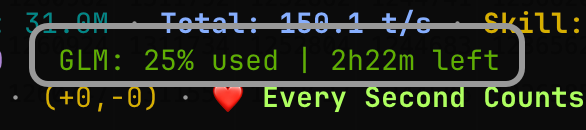

# CC Third Party Usage Monitor

**[English](./README.md)** | **[中文](./README.zh-CN.md)**

> CLI tool for monitoring third-party AI model (Kimi / GLM) API usage in Claude Code statusLine

[](https://www.npmjs.com/package/cc-third-party-usage)
[](https://opensource.org/licenses/MIT)



## ✨ Features

- **Multi-Provider Support** - Monitor Kimi (Moonshot) and GLM (Zhipu AI) API usage
- **Auto-Configuration** - Detects API credentials from environment or local proxy automatically
- **Instant Response** - Reads cache synchronously and exits in <30ms; API fetch runs in detached background process
- **Flexible Output** - Default concise format, JSON, or custom templates

## 📦 Installation & Usage

### Global Installation (Recommended)

**Why not npx/bunx?** `npx`/`bunx` adds 1-2 seconds of overhead on every invocation for package resolution and lockfile management. This overhead is problematic for any tool that expects fast command response (e.g., status bar integrations with execution timeouts). Global installation eliminates this overhead entirely.

```bash
# Using npm
npm install -g cc-third-party-usage

# Using Bun (faster)
bun install -g cc-third-party-usage

# Then run anywhere (30ms response)
cc-third-party-usage
```

### One-off Usage (npx/bunx)

> ⚠️ **Not recommended via npx/bunx.** Adds 1-2s overhead per invocation. Use global installation instead.

```bash
# Using npx
npx cc-third-party-usage

# Using bunx (slightly faster)
bunx cc-third-party-usage

# With options
npx cc-third-party-usage --json
```

### From Source

```bash
git clone https://github.com/abrahamgreyson/cc-third-party-usage.git
cd cc-third-party-usage

# Fastest option (~30ms with Node, ~18ms with Bun)
node dist/usage.js
bun dist/usage.js
```

## ⚡ Performance

| Method | Response Time | Notes |
|--------|--------------|-------|
| `node dist/usage.js` | **~30ms** | Direct file execution, fastest |
| `bun dist/usage.js` | **~18ms** | Bun runtime, even faster |
| `cc-third-party-usage` (global install) | **~900ms** | Node startup + SQLite init |
| `bunx cc-third-party-usage` | **~1100ms** | Package resolution overhead every time |
| `npx cc-third-party-usage` | **~2500ms** | Slowest, npm resolution overhead |

The tool uses an **instant-response architecture**: it reads cached data synchronously and exits immediately, then spawns a detached background process to fetch fresh API data for the next invocation. Your script execution itself is always <30ms — the time variance above is purely runtime startup overhead.

## 🚀 Integration

### Claude Code statusLine

Add to your Claude Code settings (`~/.claude/settings.json`):

```json
{
  "statusLine": {
    "command": "cc-third-party-usage"
  }
}
```

Or for the fastest response, clone and build first, then use the direct path:

```bash
git clone https://github.com/abrahamgreyson/cc-third-party-usage.git
cd cc-third-party-usage && bun run build
```

```json
{
  "statusLine": {
    "command": "node /path/to/cc-third-party-usage/dist/usage.js"
  }
}
```

### ccstatusline Integration

Using as a Custom Command widget in [ccstatusline](https://github.com/sirmalloc/ccstatusline):

1. Add a **Custom Command** widget
2. Set command: `cc-third-party-usage` (if globally installed)
3. Or set command: `node /path/to/cc-third-party-usage/dist/usage.js` (fastest)
4. Set timeout: **3000** (ms, press `t` in widget editor)

### CLI Usage

```bash
# Set environment variables first (or configure via local proxy)
export ANTHROPIC_BASE_URL=https://api.kimi.com
export ANTHROPIC_API_KEY=your-api-key

# Default output (optimized for statusLine)
cc-third-party-usage
# Output: Kimi: 45.2% used | 2h30m left

# JSON output
cc-third-party-usage --json

# Custom template
cc-third-party-usage --template "{provider}: {used}/{total} ({percent}%)"

# Verbose mode (debugging)
cc-third-party-usage --verbose

# Custom cache duration (default: 60s)
cc-third-party-usage --cache-duration 120

# Help
cc-third-party-usage --help

# Version
cc-third-party-usage --version
```

## 📋 Output Formats

### Default (statusLine-optimized)

```
Kimi: 45.2% used | 2h30m left
```

### JSON Output (`--json`)

```json
{
  "provider": "kimi",
  "quotas": [
    {
      "window": "5h",
      "total": 100,
      "used": 45,
      "remaining": 55,
      "percent": 45.2,
      "reset": "2h30m",
      "reset_timestamp": "2026-04-02T12:00:00Z"
    }
  ],
  "fetchedAt": "2026-04-02T10:30:00Z"
}
```

### Custom Templates (`--template`)

Supported placeholders:
- `{provider}` - Provider name (Kimi/GLM)
- `{total}` - Total quota (shortest window)
- `{used}` - Used quota (shortest window)
- `{remaining}` - Remaining quota (shortest window)
- `{percent}` - Usage percentage (shortest window)
- `{reset}` - Reset time (shortest window)
- `{5h_total}`, `{5h_used}`, etc. - Window-specific values

Examples:
```bash
cc-third-party-usage --template "{provider}: {used}/{total}"
# Output: Kimi: 45/100

cc-third-party-usage --template "{percent}% used, {remaining} remaining"
# Output: 45.2% used, 55 remaining
```

## 🔧 Configuration

### Environment Variables

The tool automatically detects API credentials from:
1. **Local proxy database** (if `ANTHROPIC_BASE_URL` points to localhost) - for proxy users
2. **Environment variables** (fallback):
   - `ANTHROPIC_API_KEY` or `ANTHROPIC_AUTH_TOKEN`
   - `ANTHROPIC_BASE_URL` or `BASE_URL`

### Supported Providers

| Provider | API Endpoint | Description |
|----------|--------------|-------------|
| **Kimi** | api.kimi.com | Moonshot AI |
| **GLM** | open.bigmodel.cn | Zhipu AI |

### Cache Location

Cache files are stored in system temp directory:
- **macOS/Linux**: `/tmp/cc-usage-cache/cc-usage-{provider}-cache.json`
- **TTL**: 60 seconds (configurable via `--cache-duration`)

## 🛠️ Requirements

- **Runtime**: Bun 1.3.10+ or Node.js 22.5.0+
- **API Key**: Kimi or GLM API key (via environment variable or proxy)

## 🗺️ Roadmap

**v1.0 (Current)**
- Core infrastructure with cross-runtime support
- Kimi and GLM API integration
- Automatic credential detection
- Intelligent caching layer
- Flexible CLI interface

**v1.1 (Planned)**
- Additional provider support
- Configuration file support (YAML/JSON)
- Usage history export (CSV/JSON)
- Watch mode for continuous monitoring

## 📝 License

MIT License - see [LICENSE](LICENSE) for details.

## 📮 Links

- [GitHub Repository](https://github.com/abrahamgreyson/cc-third-party-usage)
- [npm Package](https://www.npmjs.com/package/cc-third-party-usage)
- [Issue Tracker](https://github.com/abrahamgreyson/cc-third-party-usage/issues)
